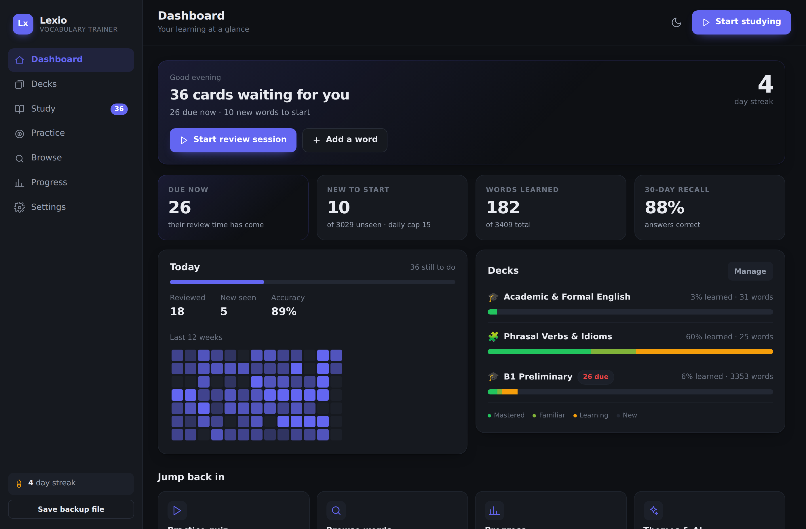

# Lexio — Kelime Öğrenme Uygulaması

Bilgisayarında çalışan, kurulum gerektirmeyen bir İngilizce kelime çalışma uygulaması.
Aralıklı tekrar (spaced repetition), deste sistemi, sekiz farklı alıştırma modu ve
özelleştirilebilir arayüz içerir. İlerlemen bilgisayarında saklanır; hiçbir yere gönderilmez.

> Uygulamanın arayüzü tamamen İngilizcedir. Bu kılavuz Türkçedir.



---

## 1. Nasıl çalıştırılır

Kod bilgisi, kurulum, hesap veya internet gerekmez.

1. Bu klasörü bilgisayarına indir (GitHub'da yeşil **Code** düğmesi → **Download ZIP**) ve ZIP'i çıkar.
2. Klasördeki **`index.html`** dosyasına çift tıkla.
3. Uygulama varsayılan tarayıcında açılır. Hepsi bu.

Sık kullanmak için tarayıcıda sayfayı yer imlerine ekleyebilirsin.

**Tarayıcı önerisi:** Chrome, Edge veya Firefox. Safari'de dosyaya çift tıklayarak açmak
bazı sürümlerde kaydetmeyi engelleyebilir; bu durumda aşağıdaki *Sorun giderme* bölümüne bak.

---

## 2. İlerlemen nasıl saklanır

Çalıştığın her kelime, tarih ve istatistik **tarayıcının kendi deposunda** (localStorage)
otomatik kaydedilir. Uygulamayı kapatıp açtığında kaldığın yerden devam edersin.

Bunun iki sınırı var, ikisi de kolayca çözülür:

- Tarayıcı geçmişini/site verilerini temizlersen kayıt da silinir.
- Başka bir bilgisayara geçersen kayıt taşınmaz.

Bu yüzden **ara sıra yedek al**: sol alttaki **Save backup file** düğmesi ya da
**Settings → Your data → Download backup (.json)**. Bu bir `.json` dosyası indirir.
Geri yüklemek için: **Settings → Restore from backup** (birleştirme veya tamamen değiştirme
seçeneğiyle). Aynı dosyayı başka bir bilgisayarda içe aktararak ilerlemeni taşıyabilirsin.

---

## 3. Ekranlar

| Ekran | Ne işe yarar |
|---|---|
| **Dashboard** | Bugün kaç kart var, seri (streak), doğruluk oranı, deste ilerlemeleri, 12 haftalık aktivite haritası |
| **Decks** | Desteleri oluştur, düzenle, sil; içindeki kelimeleri gör. Kartlardaki çubuk, destedeki kelimelerin seviyelere dağılımıdır — yeşil: Mastered, açık yeşil: Familiar, turuncu: Learning, gri: New |
| **Study** | Aralıklı tekrar seansı — asıl öğrenmenin olduğu yer |
| **Practice** | 8 farklı test/alıştırma modu |
| **Browse** | Tüm kelimeler; arama, filtre, sıralama, toplu içe/dışa aktarma |
| **Progress** | Hatırlama oranı, 14 günlük geçmiş, gelecek 14 günün tahmini, aktivite haritası (1 ay – 1 yıl arası seçilebilir; yanında dönem istatistikleri), en çok zorlandığın kelimeler |
| **Settings** | Tema, font, renk, çalışma kuralları, AI, veri yönetimi |

---

## 4. Aralıklı tekrar (spaced repetition) nasıl çalışır

Her kartı gördüğünde dört seçenekten birini işaretlersin:

| Düğme | Anlamı | Sonuç |
|---|---|---|
| **Again** (1) | Hatırlamadım | Kart aynı seansta birkaç dakika sonra tekrar gelir |
| **Hard** (2) | Zor hatırladım | Aralık kısa tutulur |
| **Good** (3) | Hatırladım | Aralık normal şekilde uzar |
| **Easy** (4) | Çok kolaydı | Aralık belirgin şekilde uzar |

Düğmelerin altında bir sonraki tekrarın ne zaman olacağı yazar (`10m`, `1d`, `2mo` gibi).
Zamanı gelen kart kalmadığında **"Study ahead anyway"** ile sırası henüz gelmemiş
kartları öne çekebilirsin (sınav öncesi işe yarar; ama beklemek uzun vadeli hafıza için
daha iyidir). Bu seansta başlıkta "ahead of schedule" yazar.

Sistem SM-2 algoritmasının Anki'de kullanılan sürümüne dayanır: yeni kartlar 1 dakika →
10 dakika → 1 gün adımlarıyla başlar, sonra her başarılı tekrarda aralık kendi
"kolaylık katsayısı" kadar çarpılarak uzar. Unuttuğun kart otomatik olarak başa döner.

**Soru yönü** (Settings → Study rules) üç şekilde çalışabilir:

| Seçenek | Ön yüzde ne var | Ne hatırlıyorsun |
|---|---|---|
| Show the English word | İngilizce kelime | Anlamını |
| Show the translation | Türkçe karşılığı | İngilizce kelimeyi |
| Show the English definition | İngilizce tanım | İngilizce kelimeyi |
| Mix all three | Sırayla hepsi | — |

Bir kartta o yönün ihtiyaç duyduğu alan yoksa (ör. çevirisi girilmemişse) uygulama
otomatik olarak başka bir yöne düşer.

**Günlük limitler** (Settings → Study rules) birikmeyi önler: varsayılan olarak günde
15 yeni kelime ve en fazla 120 tekrar. Kendine göre ayarlayabilirsin — günde 10–20 yeni
kelime sürdürülebilir bir tempodur.

---

## 5. Bir kelime kartında neler var

- **Word** — kelime veya kalıp
- **Part of speech** — sözcük türü (noun, verb, adjective, phrasal verb, idiom…)
- **Meaning** — İngilizce tanım
- **Example sentence** — kelimeyi içeren doğal bir örnek cümle
- **Translation** — Türkçe karşılığı
- **Sense label** — kelimenin birden çok anlamı varsa hangisi olduğunu söyleyen kısa etiket
- **Collocations** — kelimenin birlikte kullanıldığı kalıplar (`make a decision`)
- **Synonyms / Antonyms** — eş ve zıt anlamlılar
- **Word family** — aynı kelimenin diğer biçimleri (`analyse / analysis / analytical`)
- **Personal note** — kendi hatırlatıcı notun (isteğe bağlı)

Çalışma kartının arka yüzünde **anlam, örnek cümle ve çeviri** üstte durur; collocations,
ilişkili kelimeler, word family ve kendi notun bir çizginin altında, daha küçük punto ve iki
sütun hâlinde toplanır. Böylece cevap cevap gibi görünür, geri kalanı da kartı uzatmadan
yerini alır. Bu alt bölümü tamamen kapatmak istersen çalışma ekranının üst çubuğundaki
**Extras** düğmesine bas — çalışmanın ortasında da açıp kapatabilirsin, tercih kaydedilir.
Düğme yalnızca ilgili bölümü gösterip gizler; kart yeniden çizilmez, bulunduğun yeri
kaybetmezsin.

Kelimenin birden çok anlamı varsa **anlam etiketi kart çevrilince** kelimenin yanında
parantez içinde belirir (`turn down (to refuse)`); ön yüzde durmaz, çünkü etiketin kendisi
cevabın yarısıdır. Ön yüzde ayırt ediciliği sözcük türü sağlar.

Örnek cümlenin kelimeyi **içermesi** önemlidir: "Fill in the blank" alıştırması cümledeki
kelimeyi boşluğa çevirerek soru üretir.

**Zorunlu alanlar:** kelime, sözcük türü ve anlam. Bu üçü olmadan kart kaydedilmez —
alıştırmalar üçüne de ihtiyaç duyar. Eksik alanlar kırmızı çerçeveyle işaretlenir.
Çeviri, kategori, örnek cümle ve not isteğe bağlıdır.

> **Uygulamayı bu değişiklikten önce kullanmaya başladıysan:** başlangıç desteleri yalnızca
> boş bir koleksiyona dağıtılır, yani tarayıcında zaten kayıtlı kelimeler vardı ve yeni
> içerik onlara ulaşmıyordu. Uygulamayı bir kez açman yeterli: iki-üç anlamı tek tanıma
> sıkıştırılmış başlangıç kelimeleri **yerinde düzeltilir** (kartın kimliği, tekrar takvimi
> ve istatistikleri korunur), eksik anlamlar yanına eklenir ve `object` gelir. Kendin
> düzenlediğin hiçbir kelimeye dokunulmaz. Ne değiştiğini bir bildirimle görürsün.
>
> Koleksiyonunun güncel olup olmadığını **Settings → Your data** satırından görebilirsin:
> `starter words rev 1/1` yazıyorsa günceldir. Soldaki sayı küçükse **Restore starter
> words** düğmesine bas — eksik olanı tamamlar, güncelse "already up to date" der. Bu
> düğmeye istediğin zaman basabilirsin; kendi düzenlediğin kelimelere ve tekrar geçmişine
> asla dokunmaz.

### Birden çok anlamı olan kelimeler

`object` hem "nesne" hem "amaç" hem de "itiraz etmek" demektir; `work out` üç ayrı anlam
taşır. Bunları tek bir tanıma sıkıştırmak öğrenmeyi zorlaştırır, çünkü her anlam aslında
ayrı ayrı öğrenilir.

Uygulama her anlamı **kendi kartı** olarak tutar, yani her anlamın kendi tekrar takvimi
olur — birini iyi biliyor, diğerini yeni öğreniyor olabilirsin. Ama kartlar birbirini tanır:

- **Sense label** alanı, aynı yazılışa sahip kartlar olduğu anda kendiliğinden görünür ve
  hâlihazırda kayıtlı anlamları listeler (`Already saved: a thing, an aim, to protest`).
- Kelime listesinde anlam etiketi kelimenin altında küçük ve italik durur, satırlar
  karışmaz.
- Çalışma kartının ön yüzünde, kelimenin birden çok anlamı varsa **sözcük türü ve anlam
  etiketi** görünür. Bunlar cevabı ele vermez ama soruyu tahmin olmaktan çıkarır: "object
  ne demek?" üç doğru cevabı olan bir soru olurdu.
- Çoktan seçmelide, aynı kelimenin **başka bir anlamı asla çeldirici olarak sunulmaz** —
  aksi hâlde iki şık da doğru olurdu.

**Aynı kelimeyi ikinci kez eklersen** uygulama durur ve kayıtlı anlamları gösterir; düğme
"Save as another sense" olur. İkinci kez onayladığında yeni anlam olarak kaydedilir. Yani
yanlışlıkla kopya oluşturamazsın, ama bilerek ikinci bir anlam eklemek tek tıklık iştir.

### Collocations ve ilişkili kelimeler

Bu alanlar — collocations, synonyms/antonyms, word family ve kişisel not — kelime kartı formunda
**More fields** başlığı altında katlanmış durur; çoğu kelimede boş kaldıkları için form
doldurduğun beş alandan ibaret kalır. Bir kelimede zaten doluysalar bölüm kendiliğinden
açılır ve başlığın yanında **"3 filled in"** gibi kaç alanın dolu olduğu yazar.

- **Collocations** her satıra bir kalıp yazılır. Kartın arka yüzünde "Goes with" başlığı
  altında listelenir ve kalıbın içindeki kelime koyu gösterilir.
- **Synonyms / Antonyms** virgülle yazılır. Kaydettiğin bir kelimeyi işaret ediyorsa
  çip **dolu**, henüz eklemediğin bir kelimeyse **kesik çizgili** görünür. Kartta eş anlamlı
  `≈`, zıt anlamlı `✕` ile işaretlenir.
- İlişki tek yönde yazılır ama iki yönde çalışır: `undermine` için "weaken" yazdığında,
  `weaken` kartı da `undermine`'ı gösterir. Aynı bilgi iki kez saklanmaz, bu yüzden bir
  kelimeyi sildiğinde diğerinde kırık bir bağlantı kalmaz — sadece düz metne döner.

### Word family

`analyse / analysis / analytical / analytically` aynı kelimenin dört biçimidir. Uygulamada
bir ailenin **başı yoktur**: aile, family bağlarının birleştirdiği kümedir. Bağlar her iki
yönde ve kaç adım gerekiyorsa o kadar takip edilir, bu yüzden **yeni bir kelimeyi ailenin
herhangi bir üyesine bağlaman yeter** — geri kalanı kendiliğinden bulunur. Hangi üyeden
bakarsan bak aynı aileyi görürsün ve yeni üye eklemek hiçbir şeyi yeniden düzenlemez.

Ailenin adı da saklanmaz, üyelerin ortak kökünden hesaplanır (`analy-`) — hesaplanan bir ad
üye eklenince eskimez. Aynı yazılışa sahip kartlar (bir kelimenin farklı anlamları) aileye
dahil edilmez; onlar anlamdır, biçim değil. Sildiğin bir üye ailede soluk renkte durmaya
devam eder, yani "bu biçim var ama bende yok" bilgisi kaybolmaz.

Başlangıç destelerinde üç örnek aile var: `reliable`, `significant` ve `analyse`.

Yeni kelime eklemek için herhangi bir ekranda **N** tuşuna basman yeterli.

---

## 6. Alıştırma modları (Practice)

| Mod | Ne yapar |
|---|---|
| **Word → Meaning** | Kelimeyi görürsün, doğru anlamı seçersin |
| **Meaning → Word** | Anlamı görürsün, doğru kelimeyi seçersin |
| **Type the word** | Anlamdan yola çıkıp kelimeyi yazarsın (tek harflik yazım hatası affedilir) |
| **Fill in the blank** | Örnek cümledeki boşluğu doldurursun |
| **Matching translations** | Kelimeleri **Türkçe karşılıklarıyla** eşleştirirsin |
| **Matching meanings** | Aynı tahta, ama bu kez **İngilizce tanımla** eşleştirirsin — daha zoru |
| **Listening** | Kelime sesli okunur, duyduğunu yazarsın |
| **AI quiz** | Yapay zekâ o kelimeler için yepyeni bağlam soruları yazar |
| **Writing coach** | Kendi cümleni yazarsın, yapay zekâ puanlar ve düzeltir |

"Which words" seçeneğiyle sadece zamanı gelenleri, en zorlandıklarını ya da hiç
başlamadıklarını çalışabilirsin. **Count towards scheduling** açıkken testte kaçırdığın
kelime tekrar programında öne alınır.

**Tur uzunluğu** doğrudan Practice ekranındaki kaydırma çubuğuyla ayarlanır: seçtiğin
filtrelerde kaç kelime varsa onun **yüzdesi** olarak (%10'luk adımlarla). Çubuğun yanında
karşılığı da yazar — "40% · 26 of 66 words" gibi. Böylece 20 kelimelik bir destede de
2000 kelimelik bir destede de aynı ayar anlamlı olur. Eşleştirme modunda da geçerlidir:
%20 ile 13 kelime seçilirse en fazla 6'lık tahtalara bölünür.

Çoktan seçmeli sorulardaki **şık sayısı** (4 veya 5) Settings → Study rules altındadır.

Bir turun sonunda **"Practise the N I missed"** düğmesi yalnızca kaçırdığın kelimeleri
tekrar sorar; çeldirici şıklar arasında o turda kaçırdığın diğer kelimeler de yer alır,
çünkü karıştırdığın kelimeler genelde onlardır.

**Eşleştirme tahtası:** Solda kelimeler, sağda karşılıkları. Başlıklar hangi sütunun ne
olduğunu söyler ve sağ sütun daha soluk durur. Tahtalar en fazla 6 kelimeye bölünür ve sağ
sütunda her zaman bir fazla seçenek bulunur ki son kelime kendiliğinden ortaya çıkmasın.

**Şıklar nereden gelir:** Çoktan seçmeli sorularda yanlış şıklar önce çalıştığın kelimelerden,
yetmezse **koleksiyonun geri kalanından** seçilir. Bu yüzden tek kelimelik bir destede bile
soru dört (ya da ayara göre beş) şıkla sorulur. Sadece **Matching** seçtiğin kümede en az iki
kelime ister, çünkü orada eşleşen taraflar o kelimelerin kendisidir.

**İpucu:** "Meaning → Word", "Type the word" ve "Fill in the blank" alıştırmalarında sorunun
altında bir **Show hint** düğmesi vardır. Türkçe çeviri (boşluk doldurmada İngilizce anlam)
varsayılan olarak gizlidir, takıldığında tıklayıp görebilirsin. Puanı etkilemez, sayfayı da
oynatmaz — yazdığın cevap ve imleç yerinde kalır.
"Word → Meaning" alıştırmasında ipucu yoktur — çeviri doğrudan cevabın kendisi olurdu.

**Listening'de ipucu farklıdır:** anlamı zaten biliyorsundur, sorun sesi yakalamaktır. Bu
yüzden çeviri yerine **harf** verir: ilk basışta kelimenin ilk harfi, sonra bir harf daha,
**en fazla üç harf**. Kelime kısaysa sınır da düşer — üç harflik kelimede iki, iki harflikte
bir harf. Düğme diğer alıştırmalardaki gibi solda durur, harfler yanında belirir; üç harf dolduğunda
sönükleşir ve üzerine gelince tepki vermez. Yani kelime hiçbir zaman senin yerine
tamamlanmaz.

Bir çalışmayı ya da alıştırmayı **sonuna kadar götürdüğünde** özet ekranında ağır ağır düşen,
rengârenk bir konfeti patlar. **End session / End practice** ile yarıda bıraktığında patlamaz — kutlanan şey bitirmek.
Sisteminde "hareketi azalt" ayarı açıksa animasyon hiç çalışmaz.

Seslendirme, bilgisayarında zaten yüklü olan sesleri kullanır — internet gerekmez, ücretsizdir.

---

### İki ayrı kavram: seviye ve zamanlama

Uygulamada birbirinden bağımsız iki şey var. Karıştırmamak önemli:

**1. Bilgi seviyesi (Level)** — kelimeyi ne kadar bildiğin. Her kelime tam olarak
bunlardan birindedir:

| Seviye | Anlamı |
|---|---|
| **New** | Henüz hiç çalışılmadı |
| **Learning** | Kısa aralıklarla (dakikalar–bir gün) tekrar ediliyor |
| **Familiar** | Biliniyor ama henüz pekişmedi (aralık 21 günün altında) |
| **Mastered** | 21 gün veya daha uzun aralıklarla hatırlanıyor |

> **Aralıklar nasıl büyür?** Bir kartı **vaktinde** çalıştığında aralık tam olarak büyür
> (Good'da yaklaşık 2,5 kat). Vaktinden **önce** çalışırsan — "Study ahead" ile mümkün —
> aralık, geçen sürenin oranı kadar büyür. Aynı gün aynı karta arka arkaya Good demek
> aralığı uzatmaz: hafıza sınanmamıştır. Bu yüzden bir kartın *Mastered* olması gerçekten
> haftalar sürer.

**2. Zamanlama (Next review)** — o kelimenin sırasının gelip gelmediği.
**Due now** = tekrar vakti geldi. Bu bir seviye değildir; her seviyeden kelime
"due" olabilir. Bir kelime aynı anda hem *Familiar* hem *due now* olabilir,
ya da *Familiar* olup tekrarı bir hafta sonraya planlanmış olabilir.

Browse ekranındaki filtre bu yüzden iki gruba ayrılmıştır: **"How well I know it"**
(seviye) ve **"When it comes up"** (zamanlama). Tablodaki **LEVEL** sütunu seviyeyi,
**NEXT REVIEW** sütunu zamanlamayı gösterir.

Dashboard'daki **"Due now"** kutusu, kenar çubuğundaki rozet ve Study ekranındaki
"due now" sayısı aynı şeyi sayar: sırası gelmiş kelimeler. Bunların kaçının kısa vadeli
öğrenme adımlarında olduğu Study ekranında ayrıca yazar.

---

## 7. Görünüm

**Settings → Appearance** altında:

- **8 tema:** Dark, Light, Midnight, Nord, Forest, Sepia, Rose, Mono
- **8 vurgu rengi:** Indigo, Blue, Teal, Emerald, Amber, Rose, Violet, Slate
- **5 yazı tipi:** Sans, Rounded, Serif, Humanist, Mono — her biri hem Windows'ta hem
  macOS'ta farklı bir yazı tipine denk gelir (Windows: Segoe UI, Century Gothic,
  Palatino, Candara, Consolas)
- **4 yazı boyutu:** Small / Medium / Large / X-large (14.5 – 19 px)

Üst çubuktaki ay simgesiyle aydınlık/karanlık arasında hızlıca geçiş yapabilirsin.
Seçimlerin kaydedilir.

---

## 8. Yapay zekâ (isteğe bağlı — sorunun cevabı)

**Evet, mümkün ve ücretsiz seçenekler var.** Uygulama AI olmadan da eksiksiz çalışır;
AI yalnızca dört yerde devreye girer:

1. **Kart otomatik doldurma** — sadece kelimeyi yaz, tanım/örnek/çeviri/kategori dolsun
2. **Deste üretme** — "job interviews, B2, 15 kelime" de, hazır deste gelsin
3. **AI quiz** — her seferinde yeni bağlam cümleleriyle sorular + açıklamalar
4. **Writing coach** — yazdığın cümleyi puanlar, düzeltir, Türkçe kısa not verir

### Kurulum

**Settings → AI assistant → Enable AI features** → bir sağlayıcı düğmesine bas
(ayarlar otomatik dolar) → anahtarını yapıştır → **Test the connection**.

| Sağlayıcı | Maliyet | Anahtar nereden |
|---|---|---|
| **Google Gemini** | **Ücretsiz katman var** — başlamak için en iyisi | aistudio.google.com/apikey |
| **Groq** | **Ücretsiz katman**, çok hızlı | console.groq.com/keys |
| **OpenRouter** | `:free` etiketli modeller ücretsiz | openrouter.ai/keys |
| **OpenAI** | Ücretli ama çok ucuz (`gpt-4o-mini`) | platform.openai.com/api-keys |
| **DeepSeek** | Ücretli, çok ucuz | platform.deepseek.com |
| **Ollama** | **Tamamen ücretsiz**, kendi bilgisayarında, internetsiz | ollama.com |

### Elindeki OpenAI anahtarıyla maliyet

Bir kart doldurma veya bir quiz sorusu yaklaşık 500–1.500 token eder.
`gpt-4o-mini` ile bu **sentin küçük bir kesri** demektir: her gün yoğun kullansan bile
aylık maliyet genelde **1 doların altında** kalır. Pahalı modellere ihtiyaç yok —
bu iş için küçük modeller fazlasıyla yeterli.

### Anahtarın güvenliği

Anahtarın yalnızca **senin tarayıcında** saklanır ve sadece seçtiğin sağlayıcıya gider.
Ne bize ne başka bir sunucuya iletilir — zaten uygulamanın bir sunucusu yok.
Yine de bu dosyaları başkasıyla paylaşacaksan anahtarını önce Settings'ten sil.

> **Not:** Gemini, dosyaya çift tıklayarak açtığın halde bile çalışacak şekilde
> test edildi. Bir sağlayıcıda "Could not reach the AI provider" hatası alırsan
> aşağıdaki *Sorun giderme* adımını uygula — bu tarayıcının güvenlik kuralıyla ilgilidir,
> anahtarınla değil.

---

## 9. Kelime aktarma

- **CSV içe aktarma:** Browse → **Import**. Sütun sırası:
  `term, part of speech, sense, definition, example, translation, collocations,
  synonyms, antonyms`. Başlık satırı varsa otomatik algılanır; başlık yoksa eski altı
  sütunluk sıra (`term, part of speech, definition, example, translation, +1 sütun`)
  geçerlidir, yani eski dosyaların aynen çalışmaya devam eder — altıncı sütun artık
  okunmaz, çünkü category kaldırıldı. Collocations, synonyms ve
  antonyms sütunlarında birden çok değer **noktalı virgülle** ayrılır.
  Dosya seçebilir veya satırları yapıştırabilirsin. Aynı kelimenin **farklı anlamı**
  ayrı satır olarak eklenir; yalnızca kelime, sözcük türü ve tanımı birebir aynı olan
  satırlar atlanır ve kaç tanesinin atlandığı bildirilir.
- **CSV dışa aktarma:** Browse → **Export CSV** (Excel'de açılır).
- **Tam yedek:** Settings → **Download backup (.json)** — istatistikler dahil her şey.

**Reset all progress** (Settings → Your data) kelimeleri korur, geri kalan her şeyi siler:
kartlar *New* durumuna döner, tekrar geçmişi — seri, toplamlar, hatırlama oranı ve aktivite
haritası — temizlenir, günün sayaçları da sıfırlanır (yani günlük yeni kelime hakkın yeniden
tam olur).

---

## 10. Klavye kısayolları

| Tuş | İşlev |
|---|---|
| `Space` | Cevabı göster / devam et |
| `1` `2` `3` `4` | Kartı değerlendir (again / hard / good / easy) veya test şıkkını seç |
| `S` | Kelimeyi sesli oku |
| `U` | Son cevabı geri al |
| `N` | Yeni kelime ekle |
| `Esc` | Pencereyi kapat / seansı bitir (ekrandaki **End session** düğmesiyle aynı) |
| `D` `K` `S` `P` `B` `G` | Ekranlar arası geçiş |
| `PageUp` `PageDown` | Sayfayı yukarı/aşağı kaydır |
| `Home` `End` | Sayfanın başına/sonuna git |
| `↑` `↓` | Satır satır kaydır |

`Space` yalnızca kartı çevirir; puanı **her zaman `1`–`4`** tuşlarıyla ya da düğmelerle
verirsin. Yani farkında olmadan bir puan vermen mümkün değil.

Çalışma ya da alıştırma sürerken sağ üstteki **Start studying** düğmesi düğme olmaktan
çıkar ve nerede olduğunu söyler: **Studying** veya **Practising**. Başka bir ekrana
geçtiğinde yeniden çalışır hâle gelir.

Uzun sayfalarda sağda kaydırma çubuğu çıkar; aşağı indiğinde sağ altta
başa dönmek için yuvarlak bir düğme belirir.

---

## 11. Sorun giderme

**"Bu tarayıcı yerel depolamayı engelliyor" uyarısı alıyorum / ilerleme kaydedilmiyor**
Tarayıcı, dosyadan açılan sayfalara veri yazmayı engelliyordur (çoğunlukla Safari veya
gizli sekme). Çözüm: klasördeki **`sunucu-baslat.command`** (Mac) veya
**`sunucu-baslat.bat`** (Windows) dosyasına çift tıkla, sonra tarayıcıda
`http://localhost:8000` adresini aç. Aynı uygulama, bu kez normal bir web sayfası gibi
çalışır ve kaydetme sorunsuz olur. (Bu dosyalar bilgisayarında Python gerektirir;
yoksa Chrome veya Firefox kullanmak da sorunu çözer.)

**AI "Could not reach the AI provider" diyor**
Aynı çözüm: yukarıdaki yerel sunucu dosyasını kullan. Tarayıcılar, dosyadan açılan
sayfaların bazı sunuculara istek atmasını engelleyebiliyor; sayfa `http://localhost`
üzerinden açıldığında bu kısıt kalkar.

**Sesli okuma çalışmıyor**
İşletim sisteminde İngilizce ses paketi yüklü olmayabilir. Windows'ta
Ayarlar → Saat ve Dil → Konuşma bölümünden İngilizce ses eklenebilir.

**Kartlarım kayboldu**
Tarayıcı verileri temizlenmiş olabilir. Settings → **Restore from backup** ile
son `.json` yedeğini geri yükle.

---

## 12. Dosyalar

```
index.html   arayüz iskeleti — açılacak dosya budur
styles.css   tasarım, temalar, renkler
data.js      başlangıç desteleri (66 kelime) ve tema/font listeleri
srs.js       aralıklı tekrar algoritması
storage.js   kaydetme, yedekleme, içe/dışa aktarma, istatistik hesapları
ai.js        isteğe bağlı yapay zekâ katmanı
app.js       ekranlar, çalışma seansı, test motoru
```

Hiçbir dış kütüphane, derleme adımı veya paket kurulumu yoktur.
